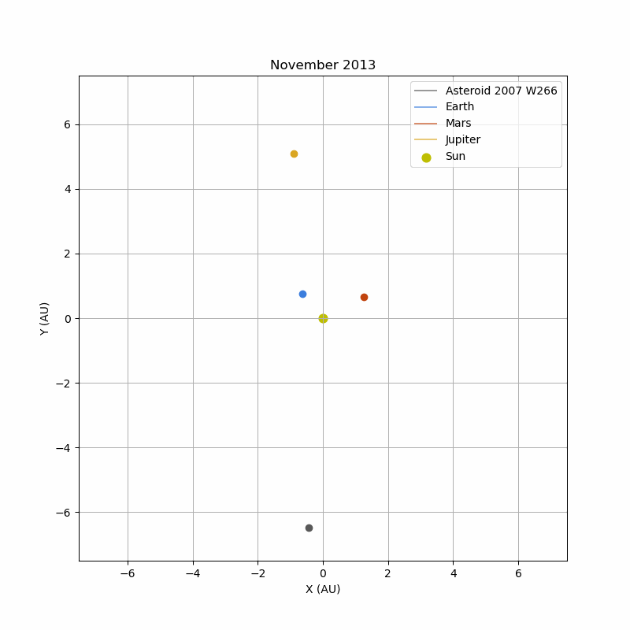

<h1 align="center">Retrograde-asteroid-near-Jupiter</h1>

**Asteroid 2007 VW266** was discovered on 12 November 2007 (UT) by the Mt. Lemmon Survey. Analysis of its orbit reveals a retrograde and inclined trajectory close to Jupiter, meaning that it is moving in the opposite direction to the giant planet.

This type of orbit is unusual, as it is generally unstable. This is why [M. Connors and P. Wiegert](https://ui.adsabs.harvard.edu/abs/2018P%26SS..151...71C/abstract) have studied the characteristics of this trajectory and the mechanisms that explain its stability.

In their article, they show that the asteroid is in **resonance with Jupiter**, which enables it to temporarily stabilise its orbit. Their study details its orbital parameters, which we are going to analyse in order to find and verify their results.

 

## 1. Asteroid'a orbit analysis
### Asteroid's orbital parameters on 5 November 2013
| Element | Name                  | Value          | Error         |
|---------|-----------------------|---------------|--------------|
| Epoch   | -                     | JD 2456600.5  | -            |
| a       | Semimajor axis        | 5.454 au      | 0.0156 au    |
| e       | Eccentricity          | 0.3896        | 0.00170      |
| i       | Inclination           | 108.358°      | 0.0261°      |
| q       | Perihelion distance   | 3.32901 au    | 0.000586 au  |
| ω       | Argument of perihelion| 226.107°      | 0.0501°      |
| Ω       | Longitude of node     | 276.509°      | 0.00114°     |
| M       | Mean anomaly          | 146.88°       | 0.604°       |

### Evolution of the semi-major axis, eccentricity and the inclination

To understand the asteroid's orbit, we can first study the evolution of the orbital parameter over time. To do that we propagate the orbit using RK4 algorithm considering the influence of Jupiter, Earth, and Mars.

We compute the the orbital elements for the next 10000 years, this is what we obtain:

 
We observe that the asteroid's orbit seems stable for the next 7000 years and after that it is instable. 

We can zoom on the first 2000 years.

- résumé de l'asteroid
- GIF
- arrivé dans l'orbite 
- résonnance
- sortie de l'orbite 
- graph évolution de la distance avec Jupiter
- Shpère de Hill